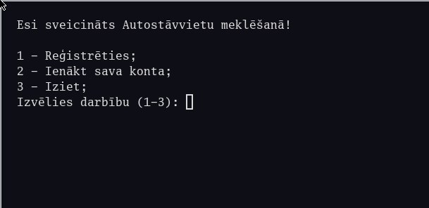

# Parkfind

A system that allows car drivers in Riga easily find a cheapest parking place in a given period of time.
Program was developed during short internship at [Riga State Technical School](https://rvt.lv).



## Features

- Persistent data about user account, parking spots and parking rates stored in CSV format
- Registering or logging in into user account
- Admin dashboard that allows for new parking and rate inserting or existing parking editing
- Algorithm optimized for finding a cheapest parking spot in selected area
- Timer that keeps track of time spent on parking and resulting price

## Tech stack

- Language: Java
- Database: CSV

## Getting started

### Prerequisites

- Java Development Kit 21+
- (Optional) any other tools, e.g. `make`, `maven`

### Running

```bash
git clone https://github.com/moonlags/parkfind.git
cd parkfind 
make compile
make run
```

### Configuration

There is no need for configuration,
but admin's credentials are Username:`admin`, password:`root`

## Project structure

```
parkfind
|
├── src/main/java   # program code
├── data/           # CSV storage files
├── README.md
└── Makefile
```

## License

[MIT](LICENSE)
